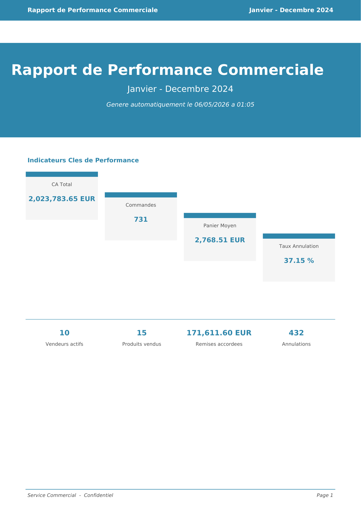
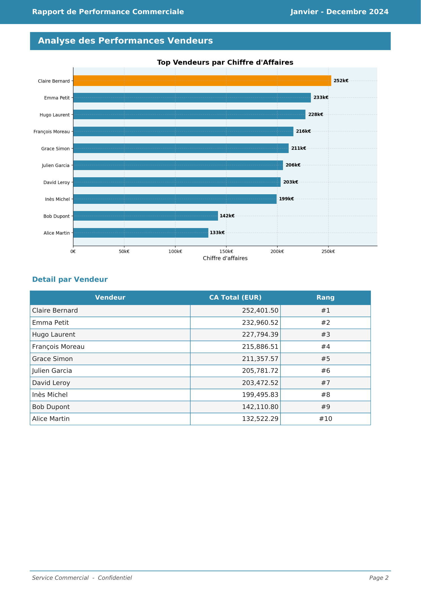
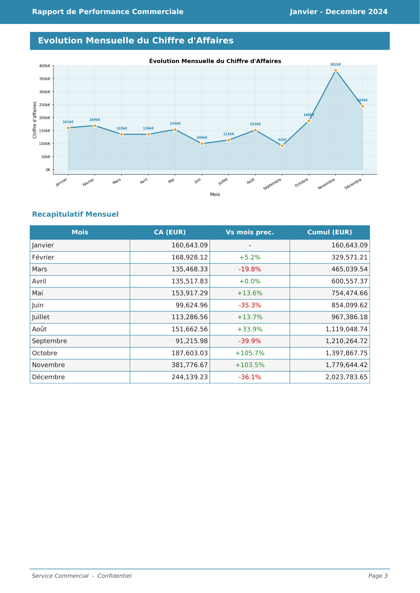
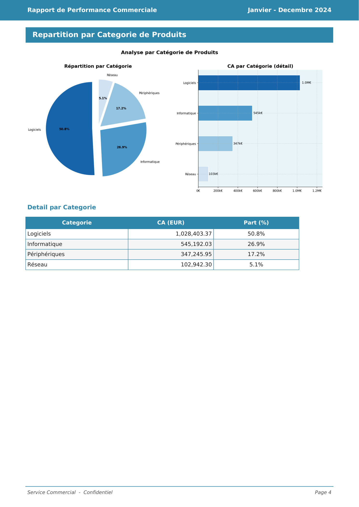
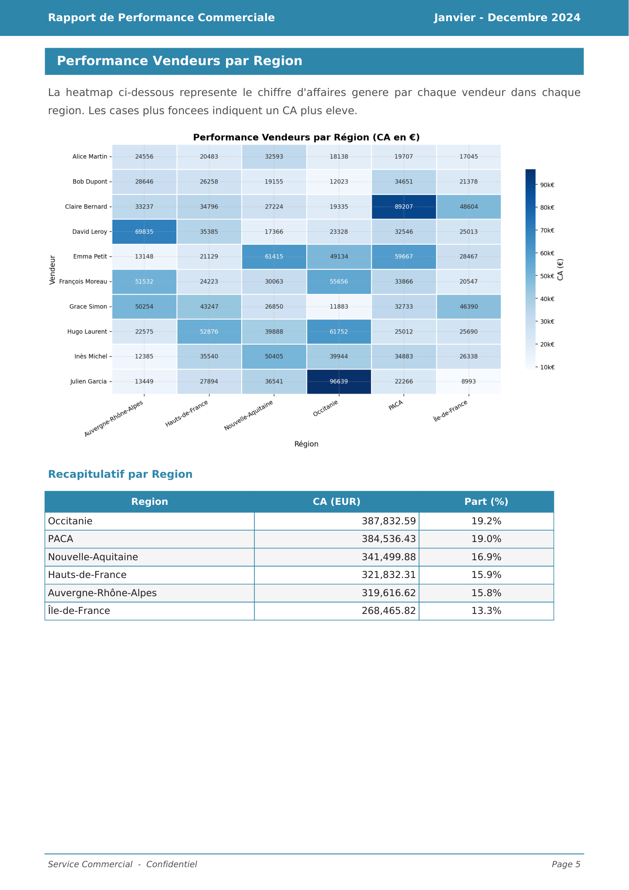
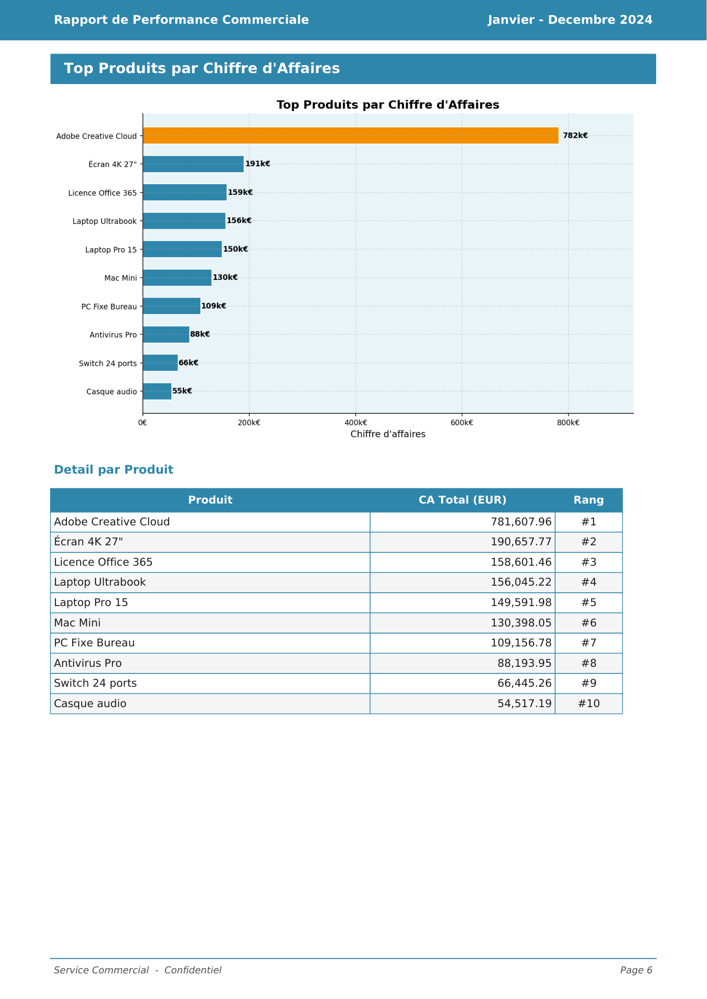

# Sales Report Automation

[](https://www.python.org/downloads/)
[](https://colab.research.google.com/github/GomuGomuNo01/sales-report-automation/blob/main/demo_colab.ipynb)
[](tests/)
[](/.github/dependabot.yml)
[](https://github.com/GomuGomuNo01/sales-report-automation)

> **Transformez vos exports ERP en rapport PDF professionnel en quelques secondes.**  
> Ce qui prenait 5 heures à la main — nettoyage Excel, calculs, graphiques, mise en page — se fait désormais en une seule commande.

---

## À l'attention des recruteurs et RH

**Vous êtes recruteur(se) et vous n'êtes pas développeur(se) ? Cette section est faite pour vous.**

Ce projet est une **démonstration concrète de mes compétences en développement et en traitement de données**. Il résout un problème réel du monde de l'entreprise : la production laborieuse et répétitive de rapports de ventes.

### Le problème résolu

Chaque mois, un responsable commercial exportait ses données de ventes depuis son logiciel de gestion (ERP) sous forme de fichiers bruts, puis passait **5 heures** à les mettre en forme à la main : fusion dans Excel, corrections, calculs, graphiques, mise en page dans PowerPoint, impression pour la réunion de direction.

J'ai développé un outil qui **fait tout ça automatiquement en 7 secondes**, à partir des mêmes fichiers bruts.

### Ce que ça produit concrètement

→ **Un rapport PDF de 6 pages, prêt à imprimer**, avec indicateurs clés, classements, graphiques et tableaux de données.  
→ **Zéro intervention humaine** entre l'export ERP et le rapport final.  
→ **Planification automatique** : l'outil peut se déclencher seul le 1ᵉʳ de chaque mois sans que personne n'ait à y penser.

Vous pouvez télécharger un exemple du rapport généré ici → [rapport_exemple_2024.pdf](examples/rapport_exemple_2024.pdf)

### Ce que ce projet dit de moi en tant que candidat

| Ce que vous cherchez | Ce que vous trouverez ici |
|----------------------|--------------------------|
| **Autonomie** | Projet conçu et réalisé seul, de l'identification du besoin au livrable final |
| **Rigueur** | 50 tests automatisés qui vérifient que chaque calcul est juste — rien n'est laissé au hasard |
| **Sens du résultat** | L'objectif était de faire gagner du temps : résultat, 5 heures réduites à 7 secondes |
| **Organisation du travail** | Code découpé en 5 modules indépendants, chacun avec un seul rôle bien défini |
| **Documentation** | README complet, exemples fournis, guide d'utilisation détaillé |
| **Bonnes pratiques** | Tests, gestion des erreurs, mises à jour de sécurité automatisées, configuration centralisée |

### Technologies utilisées — en langage courant

Pas besoin de connaître la technique pour comprendre l'essentiel :

| Outil | À quoi ça sert ici |
|-------|-------------------|
| **Python** | Le langage de programmation utilisé pour construire tout l'outil |
| **pandas** | Lit, corrige et organise les données brutes (comme Excel, mais automatisé) |
| **matplotlib / seaborn** | Génère les graphiques automatiquement |
| **fpdf2** | Construit le document PDF page par page, avec mise en page professionnelle |
| **pytest** | Vérifie automatiquement que tous les calculs produisent le bon résultat |

### Voir la démo sans rien installer

Cliquez sur le bouton ci-dessous — la démonstration se lance directement dans votre navigateur (compte Google requis, gratuit) :

[](https://colab.research.google.com/github/GomuGomuNo01/sales-report-automation/blob/main/demo_colab.ipynb)

Le pipeline s'exécute en direct sous vos yeux et génère un rapport PDF que vous pouvez télécharger. Voir la section [Démonstration interactive](#5-démonstration-interactive-google-colab) pour le guide pas-à-pas.

---

## Résultats

```
1 163 lignes CSV brutes  →  pipeline ETL  →  6 pages PDF  +  5 graphiques  →  ~7 secondes
```

| | Livrable | Lien |
|---|---|---|
| 📄 | Rapport PDF généré — 6 pages, mise en page professionnelle | [Télécharger l'exemple →](examples/rapport_exemple_2024.pdf) |
| 📋 | Fichier CSV source — données de ventes réelles simulées | [Voir l'exemple →](examples/ventes_exemple_janvier_2024.csv) |
| ▶️ | Démonstration interactive pas-à-pas dans le navigateur | [](https://colab.research.google.com/github/GomuGomuNo01/sales-report-automation/blob/main/demo_colab.ipynb) |

---

## Compétences techniques démontrées

> *Section destinée aux recruteurs souhaitant identifier rapidement les technologies et pratiques mises en œuvre.*

| Domaine | Technologies | Ce que ça signifie concrètement |
|---------|-------------|--------------------------------|
| **Traitement de données (ETL)** | Python, pandas, numpy | Lecture, fusion, nettoyage et transformation de milliers de lignes de données brutes issues d'un ERP |
| **Visualisation** | matplotlib, seaborn | Génération automatique de 5 graphiques professionnels (classements, tendances, heatmap, camembert) |
| **Génération de documents** | fpdf2 | Création de rapports PDF A4 multi-pages avec mise en page, tableaux et graphiques intégrés |
| **Automatisation** | schedule, argparse | Interface en ligne de commande, planification mensuelle automatique sans intervention humaine |
| **Qualité logicielle** | pytest, pytest-cov | 50+ tests unitaires et d'intégration, couverture de code mesurée |
| **Architecture** | Modules découplés (5 stages) | Code organisé en 5 modules indépendants, chacun avec une seule responsabilité (principe SOLID) |
| **Bonnes pratiques** | pyproject.toml, Dependabot | Configuration centralisée, mise à jour automatique des dépendances, documentation complète |

**En chiffres :** ~700 lignes de code de production · 5 modules Python indépendants · 50+ tests automatisés · 6 pages PDF + 5 graphiques en ~7 secondes

---

## Aperçu du rapport généré

<table>
  <tr>
    <td align="center"><b>Page 1 — Tableau de bord</b></td>
    <td align="center"><b>Page 2 — Performances vendeurs</b></td>
    <td align="center"><b>Page 3 — Évolution mensuelle</b></td>
  </tr>
  <tr>
    <td></td>
    <td></td>
    <td></td>
  </tr>
  <tr>
    <td align="center"><b>Page 4 — Répartition catégories</b></td>
    <td align="center"><b>Page 5 — Heatmap régions</b></td>
    <td align="center"><b>Page 6 — Top produits</b></td>
  </tr>
  <tr>
    <td></td>
    <td></td>
    <td></td>
  </tr>
</table>

---

## Sommaire

- [À l'attention des recruteurs et RH](#à-lattention-des-recruteurs-et-rh)

1. [Pourquoi cet outil ?](#1-pourquoi-cet-outil-)
2. [Comment ça fonctionne ?](#2-comment-ça-fonctionne-)
3. [Prérequis](#3-prérequis)
4. [Installation](#4-installation)
5. [Démonstration interactive (Google Colab)](#5-démonstration-interactive-google-colab)
6. [Premier rapport en 3 commandes](#6-premier-rapport-en-3-commandes)
7. [Utilisation au quotidien](#7-utilisation-au-quotidien)
8. [Format des fichiers CSV attendus](#8-format-des-fichiers-csv-attendus)
9. [Ce que contient le rapport](#9-ce-que-contient-le-rapport)
10. [Personnaliser le pipeline](#10-personnaliser-le-pipeline)
11. [Structure du projet](#11-structure-du-projet)
12. [Tests et fiabilité](#12-tests-et-fiabilité)
13. [Résolution des problèmes courants](#13-résolution-des-problèmes-courants)
14. [Dépendances](#14-dépendances)

---

## 1. Pourquoi cet outil ?

Chaque mois, un commercial exportait les données de ventes depuis l'ERP sous forme de fichiers CSV bruts, puis passait **5 heures** à :

- copier-coller les fichiers dans Excel pour les fusionner,
- nettoyer les données (doublons, valeurs manquantes, remises mal saisies…),
- calculer les KPIs à la main (CA net, panier moyen, taux d'annulation…),
- créer les graphiques un par un,
- assembler le tout dans un PowerPoint pour la réunion de direction.

Ce projet **automatise l'intégralité de ce processus**. Il suffit de déposer les fichiers CSV dans un dossier et de lancer une commande. Le rapport PDF est prêt en moins de 10 secondes.

---

## 2. Comment ça fonctionne ?

Le pipeline suit 5 étapes enchaînées automatiquement :

```
┌─────────────────────────────────────────────────────────────────────┐
│                        PIPELINE ETL + RAPPORT                       │
│                                                                     │
│  ① EXTRACTION      ② NETTOYAGE     ③ TRANSFORMATION                │
│  ┌──────────┐      ┌──────────┐    ┌──────────────┐                │
│  │ CSV bruts│ ───► │ Qualité  │───►│ Calculs KPIs │                │
│  │ (ERP)    │      │ des data │    │ + Agrégations│                │
│  └──────────┘      └──────────┘    └──────┬───────┘                │
│                                           │                         │
│                    ⑤ RAPPORT PDF          ▼  ④ VISUALISATION       │
│                    ┌──────────┐    ┌──────────────┐                │
│                    │ 6 pages  │◄───│ 5 graphiques │                │
│                    │  + KPIs  │    │     PNG      │                │
│                    └──────────┘    └──────────────┘                │
└─────────────────────────────────────────────────────────────────────┘
```

### Étape ① — Extraction
Le script scanne automatiquement le dossier `data/raw/` et charge **tous les fichiers `.csv`** qu'il y trouve, quel que soit leur nombre. Ils sont fusionnés en un seul jeu de données unifié. Chaque ligne garde une trace de son fichier d'origine.

### Étape ② — Nettoyage
Les données brutes d'ERP sont rarement parfaites. Le nettoyage gère :
- les **doublons** exacts (suppression automatique),
- les **valeurs manquantes** (suppression si la date est absente, remplacement par la médiane pour les montants, par "Inconnu" pour les champs texte),
- les **types incohérents** (dates mal formatées, quantités en texte…),
- les **remises mal saisies** (10 au lieu de 0.10 — normalisé automatiquement),
- les **valeurs impossibles** (quantités ou prix négatifs → ramenés à 0),
- les **variantes orthographiques des statuts** (`livre`, `LIVRÉ`, `Livré` → toujours `Livré`).

### Étape ③ — Transformation
C'est ici que la valeur métier est calculée :

| Calcul | Formule |
|--------|---------|
| CA brut | `quantité × prix_unitaire` |
| CA net | `CA brut × (1 − remise)` |
| CA comptabilisé | CA net si statut = Livré ou En cours, sinon 0 |
| Panier moyen | `CA total ÷ nombre de commandes actives` |
| Taux d'annulation | `(annulées + retournées) ÷ total × 100` |
| Remise totale (€) | `somme des (CA brut − CA net)` |

Les données sont ensuite agrégées par **vendeur**, **mois**, **catégorie**, **région** et **produit**.

### Étape ④ — Visualisation
Cinq graphiques PNG haute résolution (150 DPI) sont générés dans `output/charts/` :

| Fichier | Type | Contenu |
|---------|------|---------|
| `01_top_vendeurs.png` | Barres horizontales | Classement des vendeurs par CA |
| `02_evolution_mensuelle.png` | Courbe + aire | Tendance du CA mois par mois |
| `03_repartition_categorie.png` | Camembert + barres | Part de chaque catégorie |
| `04_heatmap_vendeur_region.png` | Heatmap | Croisement vendeur × région |
| `05_top_produits.png` | Barres horizontales | Classement des produits par CA |

### Étape ⑤ — Rapport PDF
Les graphiques et les données calculées sont assemblés dans un rapport A4 de 6 pages avec en-tête, pied de page, et mise en page professionnelle. Le fichier est horodaté et déposé dans `output/rapports/`.

---

## 3. Prérequis

- **Python 3.9 ou supérieur** ([télécharger](https://www.python.org/downloads/))
- **pip** (inclus avec Python)
- Système : Windows, macOS ou Linux

Pour vérifier votre version de Python :
```bash
python --version
```

---

## 4. Installation

### 4.1 Cloner ou télécharger le projet

```bash
git clone https://github.com/GomuGomuNo01/sales-report-automation.git
cd sales-report-automation
```

### 4.2 Créer un environnement virtuel (recommandé)

Un environnement virtuel isole les dépendances du projet du reste de votre système.

```bash
# Créer l'environnement
python -m venv .venv

# L'activer — Windows
.venv\Scripts\activate

# L'activer — macOS / Linux
source .venv/bin/activate
```

> Une fois activé, vous verrez `(.venv)` devant votre invite de commande.

### 4.3 Installer les dépendances

```bash
pip install -r requirements.txt
```

---

## 5. Démonstration interactive (Google Colab)

> **Aucune installation requise.** La démo fonctionne entièrement dans votre navigateur, gratuitement, grâce à Google Colab.

[](https://colab.research.google.com/github/GomuGomuNo01/sales-report-automation/blob/main/demo_colab.ipynb)

### Qu'est-ce que Google Colab ?

Google Colab est un environnement Python en ligne hébergé par Google. Il vous permet d'exécuter du code Python directement dans votre navigateur, **sans installer quoi que ce soit** sur votre ordinateur. C'est la façon la plus rapide de voir le pipeline en action.

### Lancer la démonstration en 5 étapes

**Étape 1 — Ouvrir le notebook**

Cliquez sur le badge orange *"Open in Colab"* ci-dessus. Le notebook s'ouvre dans un nouvel onglet de votre navigateur.

> Vous aurez besoin d'un compte Google (Gmail) gratuit pour exécuter les cellules.

---

**Étape 2 — Se connecter à Google**

Si vous n'êtes pas déjà connecté, Google vous demandera de vous identifier avec votre compte Google. Cliquez sur **"Se connecter"** en haut à droite.

---

**Étape 3 — Exécuter toutes les cellules**

Dans le menu en haut, cliquez sur :

```
Exécution  →  Tout exécuter
```

Ou utilisez le raccourci clavier : **`Ctrl + F9`** (Windows/Linux) · **`Cmd + F9`** (Mac)

> La première fois, Google affiche un avertissement *"Ce notebook n'a pas été créé par Google"*.  
> C'est normal — cliquez simplement sur **"Exécuter quand même"** pour continuer.

---

**Étape 4 — Attendre la génération (~30–60 secondes)**

Colab va exécuter automatiquement dans l'ordre :

| # | Ce qui se passe | Durée estimée |
|---|-----------------|---------------|
| 1 | Installation des dépendances Python | ~20 sec |
| 2 | Génération de données de ventes fictives (12 mois) | ~2 sec |
| 3 | Extraction, nettoyage et calcul des KPIs | ~3 sec |
| 4 | Génération des 5 graphiques | ~5 sec |
| 5 | Assemblage du rapport PDF 6 pages | ~3 sec |

Une barre de progression s'affiche à gauche de chaque cellule en cours d'exécution. Une coche verte ✅ indique qu'elle est terminée.

---

**Étape 5 — Consulter et télécharger les résultats**

En faisant défiler le notebook vers le bas après exécution, vous trouverez :

- 📊 **Les 5 graphiques** affichés en pleine taille directement dans la page
- 📄 **Un lien de téléchargement** pour récupérer le rapport PDF généré
- 📋 **Le journal d'exécution** du pipeline avec les métriques (lignes traitées, KPIs calculés, durée)

### Personnaliser la démonstration

Pour changer la période affichée sur la page de garde du rapport, repérez la cellule contenant :

```python
PERIODE = "Janvier - Décembre 2024"
```

Modifiez le texte entre guillemets (par exemple `"Janvier - Juin 2025"`), puis relancez toutes les cellules avec **`Ctrl + F9`**.

---

## 6. Premier rapport en 3 commandes

Si vous souhaitez installer et tester le pipeline localement sur votre machine :

```bash
# 1. Générer des données de démonstration (12 mois de ventes fictives)
python generate_data.py

# 2. Lancer le pipeline
python main.py --periode "Janvier - Décembre 2024"

# 3. Ouvrir le rapport
#    Le fichier PDF se trouve dans : output/rapports/
```

Le rapport est généré en quelques secondes. Son nom est horodaté :  
`output/rapports/rapport_20240201_083012.pdf`

---

## 7. Utilisation au quotidien

### Cas standard — rapport mensuel

Chaque mois, vous exportez vos données depuis votre ERP, copiez les fichiers CSV dans `data/raw/`, puis lancez :

```bash
python main.py --periode "Novembre 2024"
```

Le `--periode` est un **libellé libre** qui apparaît sur la page de garde du rapport. Vous pouvez écrire ce que vous voulez : `"T3 2024"`, `"Janvier - Juin 2024"`, `"Bilan annuel 2024"`.

Si vous omettez `--periode`, le script utilise automatiquement le mois courant.

### Automatisation mensuelle

Pour que le rapport se génère **automatiquement le 1er de chaque mois à 08h00**, sans intervention :

```bash
python main.py --mode schedule
```

Le processus tourne en continu. Il génère un rapport de test immédiatement au démarrage, puis attend le prochain 1er du mois. Pour l'arrêter : `Ctrl+C`.

> **Conseil :** sur un serveur, utilisez un service système (systemd, Windows Task Scheduler) pour que le processus redémarre automatiquement après un reboot.

### Toutes les options

```
python main.py [--periode "..."] [--mode once|schedule]

Options :
  --periode   Libellé de la période affiché dans le rapport (ex: "Janvier 2024")
              Par défaut : mois courant (ex: "Mai 2024")

  --mode      once      → génère un rapport et s'arrête (défaut)
              schedule  → tourne en continu, génère le 1er de chaque mois à 08h00
```

### Logs d'exécution

Chaque exécution produit un fichier de log journalier dans `output/logs/`. Il contient le détail de chaque étape, les éventuels avertissements (doublons détectés, valeurs manquantes…) et le résumé final.

```
output/logs/pipeline_20241201.log
```

---

## 8. Format des fichiers CSV attendus

### Nommage des fichiers

Les fichiers peuvent avoir n'importe quel nom. Ils doivent simplement être au format `.csv` et se trouver dans le dossier `data/raw/`. Tous les fichiers présents dans ce dossier seront automatiquement chargés et fusionnés.

> **Conseil :** nommez vos fichiers avec le mois et l'année pour vous y retrouver, par exemple `ventes_janvier_2024.csv`.

### Structure obligatoire

Chaque fichier CSV doit contenir exactement ces **9 colonnes**, dans n'importe quel ordre :

| Colonne | Type | Exemple | Description |
|---------|------|---------|-------------|
| `date` | Date | `2024-01-15` | Date de la commande (format YYYY-MM-DD) |
| `vendeur` | Texte | `Alice Martin` | Nom complet du commercial |
| `region` | Texte | `Île-de-France` | Région de vente |
| `produit` | Texte | `Laptop Pro 15` | Nom exact du produit |
| `categorie` | Texte | `Informatique` | Catégorie du produit |
| `quantite` | Entier | `3` | Nombre d'unités commandées |
| `prix_unitaire` | Décimal | `1257.97` | Prix HT par unité, en euros |
| `remise` | Décimal | `0.10` ou `10` | Remise appliquée (0.10 = 10%, les deux formats sont acceptés) |
| `statut` | Texte | `Livré` | Statut de la commande (voir ci-dessous) |

Un fichier CSV d'exemple est disponible : [examples/ventes_exemple_janvier_2024.csv](examples/ventes_exemple_janvier_2024.csv)

### Statuts reconnus

| Valeur dans le CSV | Interprétation | Comptabilisé dans le CA ? |
|--------------------|----------------|--------------------------|
| `Livré` (ou `livre`, `LIVRÉ`…) | Commande livrée | ✅ Oui |
| `En cours` (ou `encours`…) | En cours de livraison | ✅ Oui |
| `Annulé` (ou `annule`…) | Commande annulée | ❌ Non |
| `Retourné` (ou `retourne`…) | Commande retournée | ❌ Non |

> Le script tolère les variantes orthographiques (avec ou sans accent, majuscules…). Les valeurs non reconnues sont classées `Inconnu` et exclues du CA.

### Encodage des fichiers

Les fichiers doivent être en **UTF-8 avec BOM** (`utf-8-sig`). C'est le format produit par le script `generate_data.py` et celui reconnu nativement par Excel Windows.

Si vos fichiers ERP sont en UTF-8 sans BOM et affichent des caractères corrompus dans Excel, ouvrez-les avec Excel via *Données > À partir d'un fichier texte/CSV* et choisissez l'encodage UTF-8.

---

## 9. Ce que contient le rapport

Le rapport PDF généré contient **6 pages**. Un exemple complet est téléchargeable ici : [examples/rapport_exemple_2024.pdf](examples/rapport_exemple_2024.pdf)

### Page 1 — Tableau de bord exécutif


La page d'accueil résume l'essentiel en un coup d'œil :

**Indicateurs principaux (4 cartes)**

| Indicateur | Ce qu'il mesure |
|------------|----------------|
| **CA Total** | Somme du chiffre d'affaires net comptabilisé (commandes Livrées et En cours uniquement) |
| **Commandes** | Nombre de commandes actives (hors annulées et retournées) |
| **Panier Moyen** | CA Total ÷ Nombre de commandes — représente la valeur moyenne d'une commande |
| **Taux d'Annulation** | Proportion des commandes annulées ou retournées — à surveiller si > 20% |

**Indicateurs secondaires**

| Indicateur | Ce qu'il mesure |
|------------|----------------|
| Vendeurs actifs | Nombre de commerciaux distincts ayant passé au moins une commande |
| Produits vendus | Nombre de références produits distinctes |
| Remises accordées | Montant total des remises en euros sur la période |
| Annulations | Nombre brut de commandes annulées ou retournées |

---

<br clear="right"/>

### Page 2 — Performances vendeurs


- **Graphique** : classement des vendeurs par CA, en barres horizontales. Le meilleur vendeur est mis en évidence en orange.
- **Tableau** : liste complète avec le CA exact et le rang de chaque vendeur.

---

<br clear="right"/>

### Page 3 — Évolution mensuelle


- **Graphique** : courbe du CA mois par mois sur la période analysée, avec l'aire sous la courbe pour visualiser la tendance globale.
- **Tableau** : pour chaque mois, le CA, la variation par rapport au mois précédent (en %, vert si hausse, rouge si baisse) et le cumul depuis le début de la période.

> La variation M/M (mois sur mois) permet d'identifier rapidement les mois atypiques — pic de fin d'année, creux estival, etc.

---

<br clear="right"/>

### Page 4 — Répartition par catégorie


- **Camembert** : part de chaque catégorie de produits dans le CA total.
- **Barres** : même information sous forme de barres pour faciliter la comparaison des valeurs absolues.
- **Tableau** : CA et pourcentage exacts par catégorie.

---

<br clear="right"/>

### Page 5 — Heatmap vendeurs × régions


- **Heatmap** : matrice croisant chaque vendeur (lignes) avec chaque région (colonnes). Plus la case est foncée, plus le CA généré dans cette région par ce vendeur est élevé. Les cases à 0 indiquent qu'un vendeur n'a pas opéré dans cette région.
- **Tableau** : CA par région avec la part en pourcentage — utile pour identifier les régions sous-exploitées.

---

<br clear="right"/>

### Page 6 — Top produits


- **Graphique** : classement des produits les plus vendus en CA, le meilleur mis en évidence.
- **Tableau** : liste complète avec le CA et le rang de chaque produit.

---

## 10. Personnaliser le pipeline

Toutes les constantes métier et visuelles sont centralisées dans **`config.py`**. Pas besoin de toucher au code du pipeline pour les modifier.

```python
# config.py

# Titre affiché dans l'en-tête et la page de garde du PDF
RAPPORT_TITRE = "Rapport de Performance Commerciale"

# Nom affiché dans le pied de page
RAPPORT_AUTEUR = "Service Commercial"

# Couleur principale (bleu corporate) — format hexadécimal
RAPPORT_COULEUR_PRINCIPALE = "#2E86AB"

# Nombre de vendeurs et de produits à afficher dans les classements
TOP_VENDEURS_N = 10
```

### Exemples de personnalisation courante

**Changer la couleur du rapport :**
```python
RAPPORT_COULEUR_PRINCIPALE = "#1B4332"   # Vert foncé
RAPPORT_COULEUR_PRINCIPALE = "#C0392B"   # Rouge bordeaux
```

**Afficher le top 5 vendeurs au lieu du top 10 :**
```python
TOP_VENDEURS_N = 5
```

**Changer le nom de l'auteur dans le pied de page :**
```python
RAPPORT_AUTEUR = "Direction Régionale Sud"
```

---

## 11. Structure du projet

```
sales-report-automation/
│
├── main.py               ← Point d'entrée. C'est le fichier à lancer.
├── config.py             ← Toutes les constantes (chemins, couleurs, règles métier)
├── generate_data.py      ← Génère des données fictives pour tester le pipeline
├── demo_colab.ipynb      ← Notebook Google Colab interactif
├── conftest.py           ← Configuration pytest (ne pas modifier)
├── pyproject.toml        ← Métadonnées du projet et config des outils
├── requirements.txt      ← Liste des dépendances Python
│
├── .github/
│   └── dependabot.yml    ← Mise à jour automatique des dépendances (Dependabot)
│
├── src/                  ← Cœur du pipeline (une responsabilité par fichier)
│   ├── extractor.py      ← Lit et fusionne les CSV de data/raw/
│   ├── cleaner.py        ← Nettoie et standardise les données
│   ├── transformer.py    ← Calcule les KPIs et les agrégations
│   ├── visualizer.py     ← Génère les 5 graphiques PNG
│   ├── reporter.py       ← Assemble le rapport PDF final
│   └── scheduler.py      ← Gère l'exécution automatique mensuelle
│
├── tests/                ← Suite de tests automatisés
│   ├── test_cleaner.py   ← 20+ tests du nettoyage
│   └── test_transformer.py ← 30+ tests des calculs
│
├── examples/             ← Livrables d'exemple à consulter directement
│   ├── rapport_exemple_2024.pdf           ← Rapport PDF complet (6 pages)
│   └── ventes_exemple_janvier_2024.csv    ← Fichier CSV source d'exemple
│
├── data/
│   ├── raw/              ← 📥 Déposez ici vos fichiers CSV d'entrée
│   └── processed/        ← Données intermédiaires (géré automatiquement)
│
└── output/
    ├── rapports/         ← 📤 Les rapports PDF générés arrivent ici
    ├── charts/           ← Graphiques PNG (générés à chaque exécution)
    └── logs/             ← Journaux d'exécution quotidiens
```

> **Les seuls dossiers que vous manipulez manuellement sont `data/raw/` (entrée) et `output/rapports/` (sortie).**

---

## 12. Tests et fiabilité

Le projet inclut une suite de tests automatisés qui vérifient chaque fonction critique du pipeline.

### Lancer les tests

```bash
# Tous les tests avec détail
pytest

# Avec le rapport de couverture de code
pytest --cov=src --cov-report=term-missing

# Un module spécifique
pytest tests/test_cleaner.py -v
pytest tests/test_transformer.py -v
```

### Ce qui est testé

| Module | Ce que les tests vérifient |
|--------|---------------------------|
| `cleaner.py` | Suppression des doublons, gestion des NaN, correction des types, normalisation des remises, standardisation des statuts, colonnes temporelles |
| `transformer.py` | Calcul du CA brut/net/comptabilisé, cohérence des KPIs, tri des agrégations, intégrité de la heatmap, résultat global du pipeline |

Un test de base pour vérifier que tout est bien installé :

```bash
pytest tests/test_cleaner.py::TestCleanIntegration -v
```

---

## 13. Résolution des problèmes courants

### Les caractères s'affichent mal dans Excel (é, è, etc.)

**Cause :** Excel Windows interprète le fichier UTF-8 comme du CP1252.  
**Solution :** dans Excel, utilisez *Données → À partir d'un fichier texte/CSV* et sélectionnez l'encodage **UTF-8**. Si vous régénérez les données avec `generate_data.py`, les nouveaux fichiers incluront automatiquement un BOM reconnu par Excel.

---

### `FileNotFoundError: Aucun fichier CSV trouvé dans data/raw/`

**Cause :** le dossier `data/raw/` est vide.  
**Solution :** copiez vos fichiers CSV dans `data/raw/`. Pour un test rapide, lancez d'abord `python generate_data.py`.

---

### `ValueError: Colonnes manquantes dans les données`

**Cause :** un ou plusieurs fichiers CSV ne contiennent pas les 9 colonnes attendues.  
**Solution :** vérifiez que vos fichiers ont bien les colonnes `date`, `vendeur`, `region`, `produit`, `categorie`, `quantite`, `prix_unitaire`, `remise`, `statut`. Les noms de colonnes sont sensibles à la casse.

---

### Le rapport PDF est vide ou tronqué

**Cause :** les polices DejaVuSans ne sont pas trouvées.  
**Solution :** vérifiez que les fichiers `DejaVuSans.ttf`, `DejaVuSans-Bold.ttf` et `DejaVuSans-Oblique.ttf` sont bien présents à la racine du projet.

---

### Les mois s'affichent en anglais dans le rapport

**Cause :** ancienne version du pipeline utilisant `strftime("%B")` (dépendant de la locale système).  
**Solution :** assurez-vous d'utiliser la version à jour du code (la version actuelle utilise un dictionnaire de noms français indépendant de la locale).

---

### Le scheduler ne se déclenche pas à l'heure prévue

**Cause probable :** le processus a été interrompu (redémarrage du serveur, fermeture du terminal).  
**Solution :** relancez `python main.py --mode schedule`. Pour une exécution persistante, configurez un service système (Windows Task Scheduler, systemd sur Linux).

---

## 14. Dépendances

| Package | Version minimale | Rôle dans le projet |
|---------|-----------------|---------------------|
| `pandas` | 3.0 | Chargement, nettoyage et agrégation des données |
| `matplotlib` | 3.10 | Génération de tous les graphiques |
| `seaborn` | 0.13 | Heatmap et styles visuels avancés |
| `fpdf2` | 2.8 | Création du rapport PDF |
| `openpyxl` | 3.1 | Support de l'export Excel (optionnel) |
| `schedule` | 1.2 | Planification mensuelle automatique |
| `faker` | 40 | Génération de données de test réalistes |
| `pytest` | 9 | Exécution des tests automatisés |
| `pytest-cov` | 5 | Rapport de couverture de code |

Les mises à jour de ces dépendances sont gérées automatiquement chaque lundi via [Dependabot](.github/dependabot.yml).

---

<br clear="right"/>

---

*Généré automatiquement par le pipeline — pour toute question, consultez les logs dans `output/logs/`.*
