# Automatisation des rapports de ventes avec Python


Projet d'automatisation de bout en bout : à partir d'exports de ventes bruts issus d'un ERP, production automatique d'un **rapport PDF de 6 pages** prêt pour la réunion de direction. Ce qui demandait **5 heures de travail manuel chaque mois** se fait désormais **en quelques secondes**, sans intervention.

[](https://sales-report-automation.streamlit.app)
[](examples/rapport_exemple_2024.pdf)

*Application web : aucun compte, aucune installation, un clic suffit pour générer et télécharger un rapport. D'autres façons de tester le projet sont décrites dans [Reproduire le projet](#14-reproduire-le-projet).*

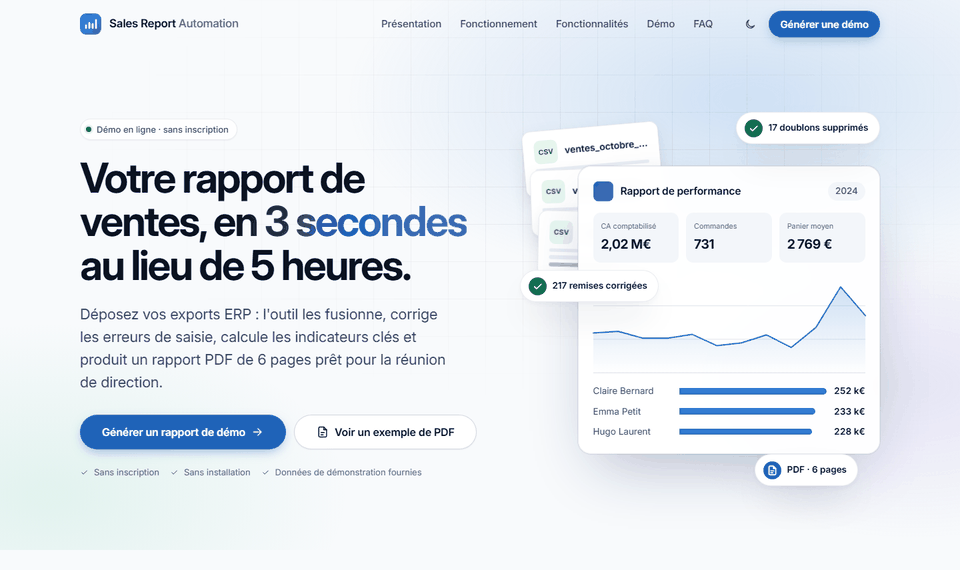

*L'application en action : un clic sur « Générer un rapport de démo » exécute le vrai pipeline sur 12 fichiers de ventes volontairement mal saisis. Chaque étape s'affiche en direct, puis le tableau de bord présente les indicateurs, les graphiques interactifs et les anomalies corrigées, avec le rapport PDF à télécharger.*

---

## Sommaire

1. [Le projet en bref](#1-le-projet-en-bref)
2. [Les résultats en bref](#2-les-résultats-en-bref)
3. [Contexte et objectifs](#3-contexte-et-objectifs)
4. [Problématiques traitées](#4-problématiques-traitées)
5. [Données utilisées](#5-données-utilisées)
6. [Outils et technologies](#6-outils-et-technologies)
7. [Méthodologie](#7-méthodologie)
8. [Étapes de réalisation](#8-étapes-de-réalisation)
9. [Le rapport généré](#9-le-rapport-généré)
10. [Analyses et résultats détaillés](#10-analyses-et-résultats-détaillés)
11. [Utilisation au quotidien](#11-utilisation-au-quotidien)
12. [Principaux enseignements](#12-principaux-enseignements)
13. [Structure du projet](#13-structure-du-projet)
14. [Reproduire le projet](#14-reproduire-le-projet)
15. [Limites et pistes d'amélioration](#15-limites-et-pistes-damélioration)
16. [Crédits](#16-crédits)

---

## 1. Le projet en bref

> **En une phrase :** j'ai remplacé une tâche manuelle de 5 heures par mois (fusionner des exports, les corriger, calculer les indicateurs, faire les graphiques, mettre en page) par un outil qui produit le même rapport en quelques secondes.

### La situation

Chaque mois, un responsable commercial exporte les ventes depuis le logiciel de gestion de l'entreprise (ERP) sous forme de fichiers CSV bruts. Il les fusionne dans Excel, corrige les erreurs de saisie, calcule les indicateurs à la main, crée les graphiques un par un puis assemble le tout dans un PowerPoint pour la réunion de direction. Résultat : **5 heures perdues chaque mois**, et un risque d'erreur à chaque copier-coller.

### Ce que j'ai fait

| Étape | En pratique |
|---|---|
| **Comprendre le besoin** | Décomposition de la tâche manuelle en 5 étapes répétitives et identification des erreurs de saisie qui faussent les chiffres sans alerte visible |
| **Fiabiliser les données** | Détection et correction automatiques des doublons, valeurs manquantes, remises saisies en pourcentage, statuts mal orthographiés, quantités négatives |
| **Calculer les indicateurs** | CA brut, net et comptabilisé, panier moyen, taux d'annulation, remises, puis classements par vendeur, mois, catégorie, région et produit |
| **Produire le livrable** | 5 graphiques et un rapport PDF A4 de 6 pages, mis en page et horodaté |
| **Automatiser** | Une seule commande, et une planification qui génère le rapport seule le 1er de chaque mois |
| **Rendre le projet testable par tous** | Une application web soignée (design system, animations, accessibilité, mobile) qui exécute le vrai pipeline dans le navigateur, sans installation |
| **Vérifier chaque résultat** | 199 tests automatisés sur le nettoyage, les calculs, le service et l'API web |

### Ce que ce projet démontre

- **Sens du résultat** : partir d'un temps perdu mesurable (5 heures) et le supprimer, plutôt que de produire du code pour lui-même.
- **Rigueur** : les corrections appliquées aux données sont signalées dans un journal d'exécution, et les calculs sont vérifiés par des tests.
- **Esprit critique sur les données** : repérer les pièges silencieux (une remise saisie `10` au lieu de `0.10` donnerait un chiffre d'affaires négatif sans aucun message d'erreur).
- **Organisation du code** : 5 modules indépendants avec une seule responsabilité chacun, une configuration centralisée, trois interfaces (ligne de commande, planificateur, application web) branchées sur le même cœur.
- **Pensée utilisateur** : un livrable compréhensible par une direction non technique, et une démo utilisable par un recruteur en un clic, au clavier comme sur mobile.
- **Soin du produit** : une interface conçue comme un produit fini, avec un design system, des animations au service de la compréhension et une accessibilité vérifiée.
- **Autonomie** : projet mené seul de bout en bout, de l'identification du besoin au déploiement.

### Pour découvrir le travail en 2 minutes

1. Ouvrir la [démo en ligne](https://sales-report-automation.streamlit.app) et cliquer sur **Générer un rapport de démo**.
2. Parcourir [les pages du rapport généré](#9-le-rapport-généré).
3. Lire [les résultats détaillés](#10-analyses-et-résultats-détaillés), en particulier la robustesse face aux données mal saisies.

## 2. Les résultats en bref

**Le constat.** Le rapport mensuel demandait **5 heures** de travail manuel. Le pipeline le produit en **environ 3 secondes** pour 12 fichiers et 1 163 lignes de ventes, de la lecture des CSV jusqu'au PDF final.

**Ce que l'outil apporte**

1. **Un gain de temps immédiat** : une commande remplace une demi-journée de manipulations, et la planification supprime même cette commande.
2. **Des chiffres fiables** : sur des données volontairement dégradées (doublons, remises mal saisies, statuts incohérents, valeurs manquantes), le pipeline retrouve le chiffre d'affaires réel **à 1,1 % près**. Sans nettoyage, le même calcul donnerait un chiffre d'affaires **négatif** (−1,48 M€).
3. **Un livrable homogène** : le même rapport de 6 pages chaque mois, avec la même mise en page et les mêmes définitions d'indicateurs.

**Les livrables**

| Livrable | Lien |
|---|---|
| Application web de démonstration | [Ouvrir la démo](https://sales-report-automation.streamlit.app) |
| Exemple de rapport PDF généré (6 pages) | [rapport_exemple_2024.pdf](examples/rapport_exemple_2024.pdf) |
| Exemple de fichier CSV source | [ventes_exemple_janvier_2024.csv](examples/ventes_exemple_janvier_2024.csv) |
| Démonstration pas à pas dans un notebook | [Google Colab](https://colab.research.google.com/github/GomuGomuNo01/sales-report-automation/blob/main/demo_colab.ipynb) |

## 3. Contexte et objectifs

**L'entreprise** est une PME (fictive) qui distribue du matériel et des logiciels informatiques. Elle emploie 10 commerciaux répartis sur 6 régions françaises et vend 15 produits classés en 4 catégories : Informatique, Périphériques, Logiciels et Réseau.

**Scénario.** L'ERP de l'entreprise produit un fichier CSV de ventes par mois. Ces exports sont bruts : ils contiennent des doublons, des trous et des fautes de saisie. Le responsable commercial doit en tirer chaque mois un rapport pour la direction. L'objectif est de lui fournir un outil qui :

- **supprime le travail manuel** entre l'export ERP et le rapport final ;
- **fiabilise les chiffres**, quelles que soient les erreurs de saisie ;
- **fonctionne sans lui**, grâce à une exécution planifiée ;
- **peut être essayé par n'importe qui**, sans compétence technique ni installation.

## 4. Problématiques traitées

| # | Question | Partie prenante |
|---|---|---|
| 1 | Comment fusionner automatiquement un nombre variable d'exports mensuels ? | Responsable commercial |
| 2 | Comment fiabiliser des données saisies à la main (doublons, remises en %, statuts incohérents, trous) ? | Contrôle de gestion |
| 3 | Quel est le CA réellement acquis une fois les annulations et retours exclus, et qui le porte (vendeurs, produits, régions) ? | Direction commerciale |
| 4 | Comment présenter ces résultats dans un document lisible en quelques minutes ? | Direction |
| 5 | Comment produire ce rapport chaque mois sans avoir à y penser ? | Responsable commercial |
| 6 | Comment permettre à une personne non technique de tester l'outil sans rien installer ? | Recruteurs, futurs utilisateurs |

**Indicateur principal : le CA comptabilisé** (CA net des commandes livrées ou en cours), suivi avec le **taux d'annulation** comme garde-fou.

## 5. Données utilisées

| Élément | Détail |
|---|---|
| Source | Données fictives mais réalistes produites par [`generate_data.py`](generate_data.py), avec une graine fixe pour des résultats reproductibles |
| Période | janvier à décembre 2024 |
| Volume | 12 fichiers mensuels, 1 163 lignes de vente, 10 vendeurs, 6 régions, 15 produits, 4 catégories |
| Saisonnalité | pic en novembre et décembre (Black Friday, fêtes), creux estival de juin à août |
| Devise | euros (EUR), prix hors taxes |
| Anomalies | ajoutées à la demande dans l'application web pour simuler un export ERP réel |

### Structure attendue des fichiers CSV

Le pipeline charge **tous les fichiers `.csv`** du dossier `data/raw/`, quel que soit leur nom ou leur nombre. Chaque fichier doit contenir ces **9 colonnes**, dans n'importe quel ordre :

| Colonne | Type | Exemple | Description |
|---|---|---|---|
| `date` | Date | `2024-01-15` | Date de la commande (format AAAA-MM-JJ) |
| `vendeur` | Texte | `Alice Martin` | Nom du commercial |
| `region` | Texte | `Île-de-France` | Région de vente |
| `produit` | Texte | `Laptop Pro 15` | Nom du produit |
| `categorie` | Texte | `Informatique` | Catégorie du produit |
| `quantite` | Entier | `3` | Nombre d'unités commandées |
| `prix_unitaire` | Décimal | `1257.97` | Prix unitaire HT en euros |
| `remise` | Décimal | `0.10` ou `10` | Remise appliquée (les deux formats sont acceptés) |
| `statut` | Texte | `Livré` | Statut de la commande |

**Statuts reconnus**

| Valeur dans le CSV | Interprétation | Compté dans le CA |
|---|---|---|
| `Livré` (ou `livre`, `LIVRÉ`…) | Commande livrée | Oui |
| `En cours` (ou `encours`…) | En cours de livraison | Oui |
| `Annulé` (ou `annule`…) | Commande annulée | Non |
| `Retourné` (ou `retourne`…) | Commande retournée | Non |

Les variantes d'accents, de majuscules et d'espaces sont harmonisées. Une valeur non reconnue devient `Inconnu`.

**Format technique :** séparateur virgule, encodage UTF-8 (avec ou sans BOM). Un fichier d'exemple est fourni : [examples/ventes_exemple_janvier_2024.csv](examples/ventes_exemple_janvier_2024.csv).

## 6. Outils et technologies

| Outil | Utilisation dans le projet |
|---|---|
| **Python 3.11+** | Langage de l'ensemble du projet |
| **pandas** | Lecture et fusion des CSV, nettoyage, typage, calculs et agrégations |
| **matplotlib / seaborn** | Les 5 graphiques (barres, courbe, camembert, heatmap) |
| **fpdf2** | Construction du rapport PDF A4, avec polices Unicode embarquées (DejaVu) pour les accents et le symbole € |
| **schedule** | Exécution automatique le 1er de chaque mois |
| **argparse** | Interface en ligne de commande |
| **HTML, CSS, JavaScript** | Interface web sans framework : design system à base de tokens, système d'animation centralisé, graphiques SVG natifs |
| **Streamlit (`st.App`) / Starlette** | Serveur web : sert l'interface et l'API de génération (progression en direct) ; hébergeable gratuitement sur Streamlit Community Cloud |
| **pytest** | 199 tests automatisés (nettoyage, calculs, service et API web) |
| **Docker / Dev Containers** | Lancement de l'application sans installer Python (Docker, GitHub Codespaces) |
| **Git / GitHub, Dependabot** | Versionnage, branches de travail, mise à jour automatique des dépendances |

## 7. Méthodologie

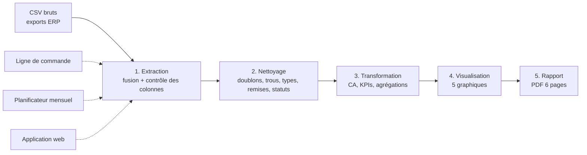
```mermaid
flowchart LR
    A[CSV bruts<br/>exports ERP] --> B[1. Extraction<br/>fusion + contrôle des colonnes]
    B --> C[2. Nettoyage<br/>doublons, trous, types, remises, statuts]
    C --> D[3. Transformation<br/>CA, KPIs, agrégations]
    D --> E[4. Visualisation<br/>5 graphiques]
    E --> F[5. Rapport<br/>PDF 6 pages]
    G[Ligne de commande] -.-> B
    H[Planificateur mensuel] -.-> B
    I[Application web] -.-> B
```

Trois principes ont guidé le travail :

1. **Une responsabilité par module** : chaque étape est un fichier indépendant qui reçoit un résultat et en renvoie un autre. On peut modifier le nettoyage sans toucher au rapport, et brancher une nouvelle interface sans réécrire le pipeline.
2. **Ne pas corriger en silence** : les anomalies détectées (doublons, valeurs manquantes, lignes supprimées…) et les étapes de correction sont signalées dans un journal d'exécution.
3. **Vérifier chaque calcul** : les fonctions de nettoyage et de calcul sont couvertes par des tests qui comparent les résultats à des valeurs attendues calculées à la main.

## 8. Étapes de réalisation

### 8.1 Extraction

- Lecture de **tous les fichiers CSV** du dossier `data/raw/`, quel que soit leur nombre, puis fusion en un seul jeu de données.
- Ajout d'une colonne `source_fichier` sur chaque ligne pour savoir d'où elle vient.
- **Contrôle des colonnes** : si une colonne attendue manque, le pipeline s'arrête avec un message qui la nomme, plutôt que de produire un rapport faux.

### 8.2 Nettoyage

- **Doublons exacts** : supprimés.
- **Valeurs manquantes** : ligne supprimée si la date manque (non récupérable), médiane pour les montants, `Inconnu` pour les champs texte.
- **Types incohérents** : dates mal formatées, quantités saisies en texte, espaces parasites.
- **Remises saisies en pourcentage** : `10` au lieu de `0.10` est divisé par 100. Sans cette correction, le CA de la ligne deviendrait négatif.
- **Valeurs impossibles** : quantités ou prix négatifs ramenés à 0.
- **Statuts** : `livre`, `LIVRÉ`, ` livré ` deviennent tous `Livré`.
- **Colonnes temporelles** : année, mois, nom du mois en français (indépendant de la langue du système), semaine, trimestre.

### 8.3 Transformation

| Calcul | Formule |
|---|---|
| CA brut | `quantité × prix_unitaire` |
| CA net | `CA brut × (1 − remise)` |
| CA comptabilisé | CA net, sauf commandes annulées ou retournées (0) |
| Panier moyen | `CA comptabilisé ÷ nombre de commandes actives` |
| Taux d'annulation | `(annulées + retournées) ÷ total des lignes × 100` |
| Remises accordées | `somme des (CA brut − CA net)` |

Les résultats sont ensuite agrégés par vendeur, mois, catégorie, région, produit, et croisés vendeur × région. Extrait de [`src/transformer.py`](src/transformer.py) :

```python
df["ca_brut"] = df["quantite"] * df["prix_unitaire"]
df["ca_net"]  = (df["ca_brut"] * (1 - df["remise"])).round(2)

# Les commandes annulées ou retournées ne comptent pas dans le CA
df["ca_comptabilise"] = np.where(
    df["statut"].isin(EXCLUDED_STATUTS), 0.0, df["ca_net"]
)
```

### 8.4 Visualisation

| Graphique | Type | Contenu |
|---|---|---|
| Top vendeurs | Barres horizontales | Classement des vendeurs par CA, le premier mis en évidence |
| Évolution mensuelle | Courbe et aire | Tendance du CA mois par mois |
| Répartition par catégorie | Camembert et barres | Part et montant de chaque catégorie |
| Vendeurs × régions | Heatmap | CA de chaque vendeur dans chaque région |
| Top produits | Barres horizontales | Classement des produits par CA |

Les graphiques sont produits en PNG à 150 DPI, avec une palette et un style communs.

### 8.5 Rapport PDF

- Document A4 de **6 pages** : tableau de bord, vendeurs, évolution mensuelle, catégories, régions, produits.
- Une page de garde avec les indicateurs clés, puis 5 pages associant chacune un graphique et un tableau de valeurs exactes.
- En-tête, pied de page, date de génération et nom de fichier horodaté.
- Polices DejaVu embarquées pour afficher correctement les accents et le symbole €.

### 8.6 Automatisation

- **Ligne de commande** : `python main.py --periode "Novembre 2024"` exécute les 5 étapes.
- **Planification** : `python main.py --mode schedule` génère le rapport seul le 1er de chaque mois à 8 h.
- **Journal** : chaque exécution écrit un fichier de log quotidien dans `output/logs/`.

### 8.7 Application web

L'interface est un frontend sur mesure, sans framework, servi avec son API par `st.App` (Streamlit 1.65). Elle appelle **exactement les mêmes modules** que la ligne de commande : rien n'est réimplémenté.

| Accueil | Tableau de bord |
|---|---|
| 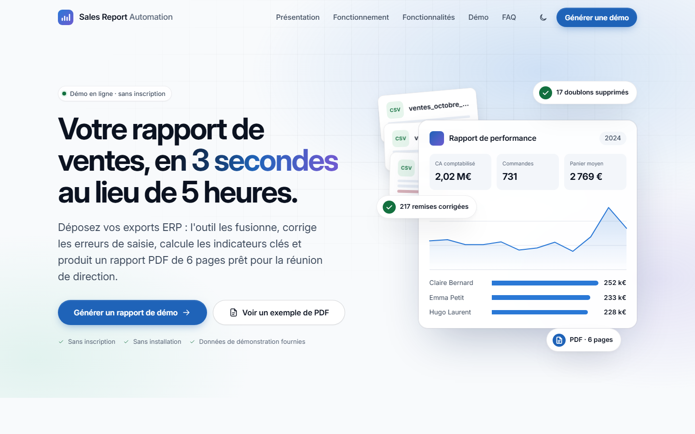 | 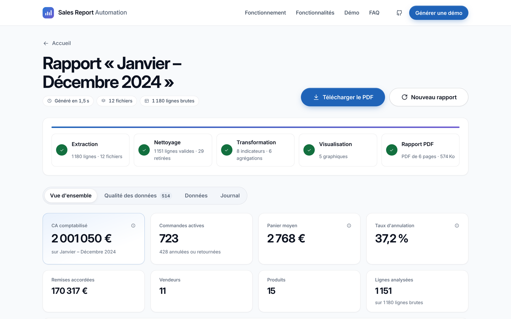 |
| **Graphiques interactifs** | **Diagnostic qualité** |
| 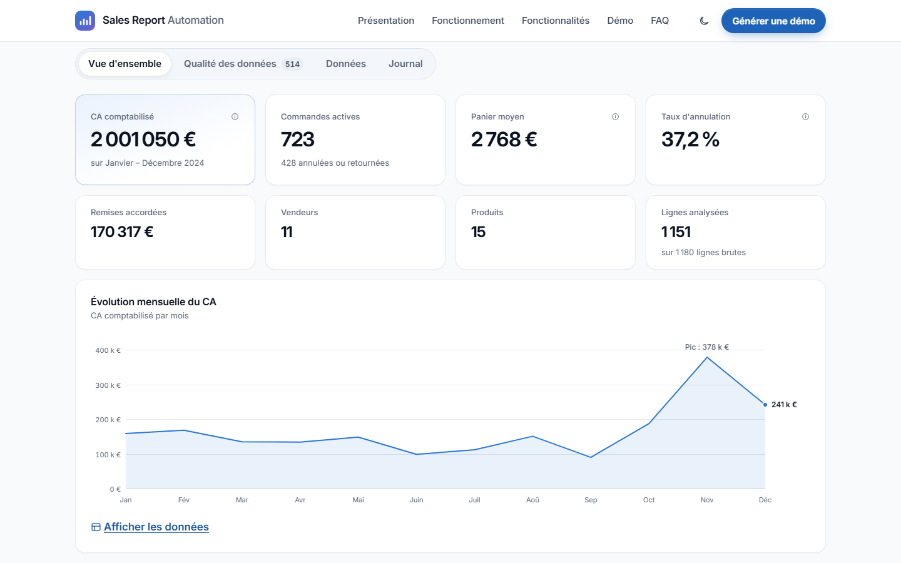 | 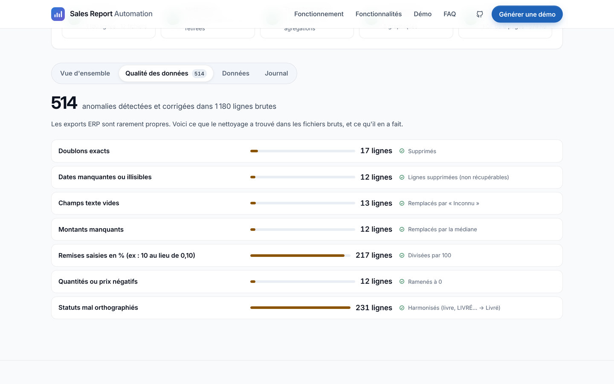 |

| Mobile | Thème sombre |
|---|---|
| 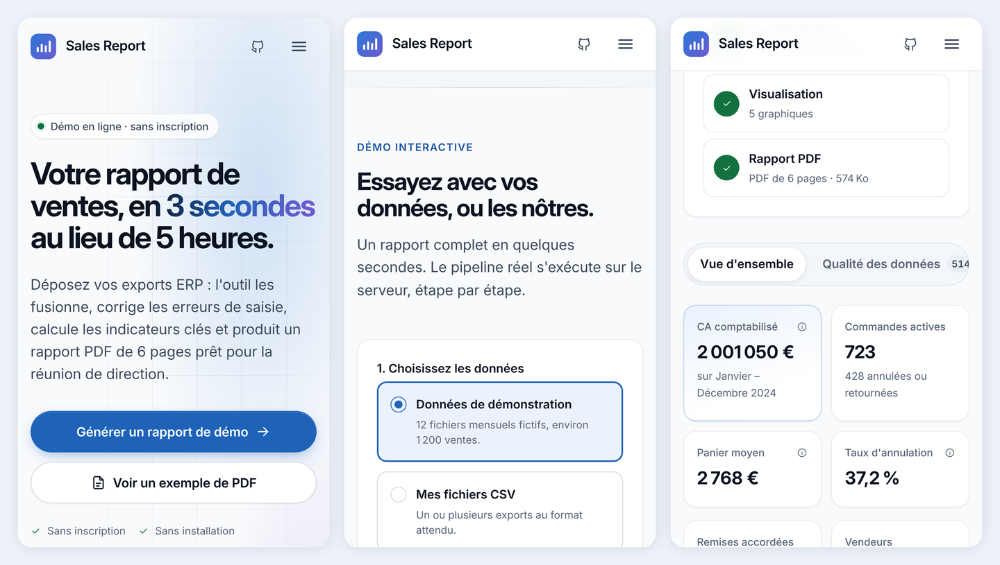 |  |

**Parcours**
- **Démo en un clic** : 12 mois de données, avec des anomalies typiques d'un export ERP ajoutées volontairement.
- **Vos propres fichiers** : glisser-déposer de CSV, fichier modèle, format attendu dans une fenêtre dédiée, erreurs affichées sous le champ concerné.
- **Progression en direct** : le serveur envoie l'avancement réel de chaque étape (flux NDJSON), la vue rapport s'ouvre aussitôt avec un squelette de chargement.
- **Tableau de bord** : 8 indicateurs (avec leur mode de calcul en infobulle), 6 graphiques SVG natifs explorables au survol et au clavier, chacun avec sa vue tableau, diagnostic qualité, données nettoyées en CSV et journal d'exécution.
- **Téléchargement du rapport PDF** de 6 pages.

**Design system** ([`tokens.css`](webapp/static/assets/css/tokens.css))
- Une seule source de vérité pour les couleurs (thème clair et thème sombre choisis, pas inversés), la typographie fluide (`clamp()`), les espacements (4 à 128 px), les rayons, les ombres, les plans et les breakpoints.
- Des composants réutilisables : bouton (états survol, actif, focus, désactivé, chargement, succès), carte, champ, interrupteur, onglets, accordéon, infobulle, toast, fenêtre de dialogue, squelette, étapes.
- Les couleurs des graphiques ont été validées (contraste et daltonisme) avant d'être retenues.

**Système d'animation** ([`motion.js`](webapp/static/assets/js/motion.js))
- Durées et courbes partagées (micro-interaction 140 ms, survol 180 ms, composant 260 ms, transition 380 ms, animation complexe 640 ms), amplitudes plafonnées à 24 px, `transform` et `opacity` uniquement.
- Apparitions au défilement avec une hiérarchie temporelle (titre, texte, bouton, visuel), narration au défilement pour les 5 étapes du pipeline, transitions de vue (View Transitions API, avec repli).
- Effets liés au curseur (parallaxe du visuel, lueur des cartes, boutons légèrement magnétiques) réservés à la souris ; parallaxe au défilement réservée aux grands écrans.
- Avec `prefers-reduced-motion`, plus rien ne bouge : le contenu s'affiche directement.

**Accessibilité et responsive**
- Navigation complète au clavier (lien d'évitement, onglets aux flèches, focus visible partout, piège de focus dans le menu et la fenêtre de dialogue), annonces `aria-live` de la progression et des erreurs, contrastes AA vérifiés.
- Conception mobile d'abord, sans débordement horizontal, de 320 px aux grands écrans ; zones tactiles de 44 px minimum.
- Page d'accueil légère : environ 190 Ko transférés, aucun framework, une seule police variable allégée à 68 Ko, images WebP chargées à la demande, aucun décalage de mise en page.

**Robustesse côté serveur**
- Chaque génération travaille dans ses propres dossiers temporaires ; les générations sont sérialisées (matplotlib n'est pas prévu pour le multi-thread).
- Les envois sont contrôlés avant tout traitement : 30 fichiers et 20 Mo au maximum, en-têtes vérifiés sans pandas, nombre de vendeurs, régions et catégories plafonné pour qu'un fichier piégé ne bloque pas les autres visiteurs.
- Les rapports restent téléchargeables une heure, en mémoire, via un identifiant aléatoire.

### 8.8 Contrôle qualité

| Fichier de tests | Ce qui est vérifié |
|---|---|
| [`tests/test_cleaner.py`](tests/test_cleaner.py) | Doublons, valeurs manquantes, types, remises, valeurs négatives, statuts, colonnes temporelles, nettoyage complet |
| [`tests/test_transformer.py`](tests/test_transformer.py) | CA brut, net et comptabilisé, cohérence des KPIs, tri des classements, heatmap, transformation complète |
| [`tests/test_service.py`](tests/test_service.py) | Données de démo, anomalies et diagnostic, libellé de période, noms de fichiers sûrs, contrôle des en-têtes et des limites, cache des rapports, pipeline complet |
| [`tests/test_webapp.py`](tests/test_webapp.py) | Routes de l'API, flux de progression (non mis en tampon, y compris compressé), validations 422, téléchargements PDF et CSV, en-têtes de sécurité |

L'interface a en plus été auditée dans un navigateur réel (accessibilité automatique avec axe-core, clavier seul, 11 tailles d'écran, mouvement réduit, réseau lent), chaque problème trouvé étant vérifié puis corrigé.

## 9. Le rapport généré

📥 **[Télécharger un exemple de rapport (`rapport_exemple_2024.pdf`, 6 pages)](examples/rapport_exemple_2024.pdf)**

| Page | Contenu |
|---|---|
| 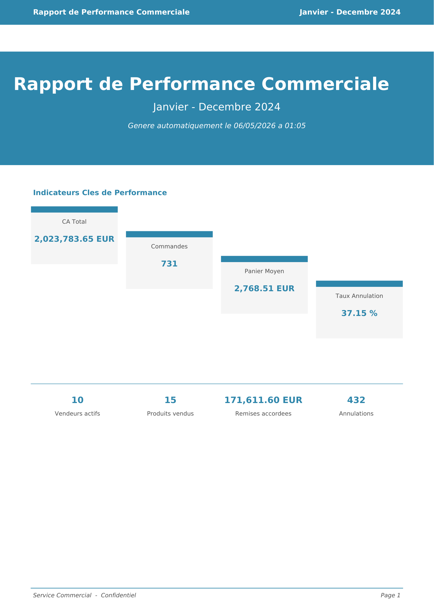 | **Tableau de bord** : CA total, commandes, panier moyen, taux d'annulation, puis vendeurs actifs, produits vendus, remises accordées et nombre d'annulations |
| 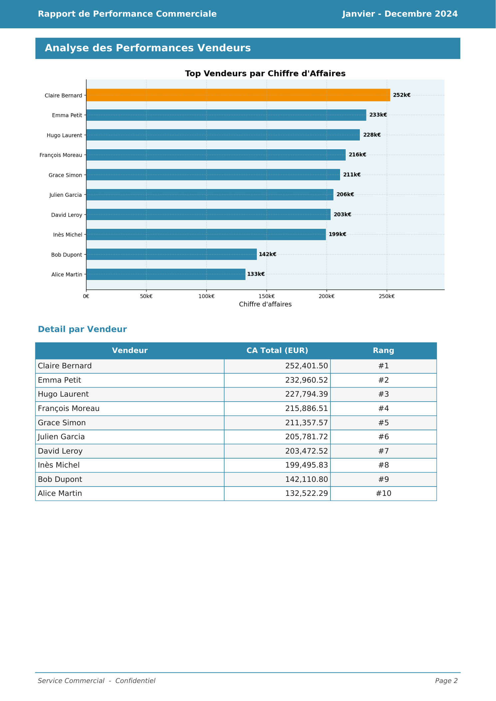 | **Performances vendeurs** : classement par CA en barres, meilleur vendeur mis en évidence, tableau avec rang et CA exact |
| 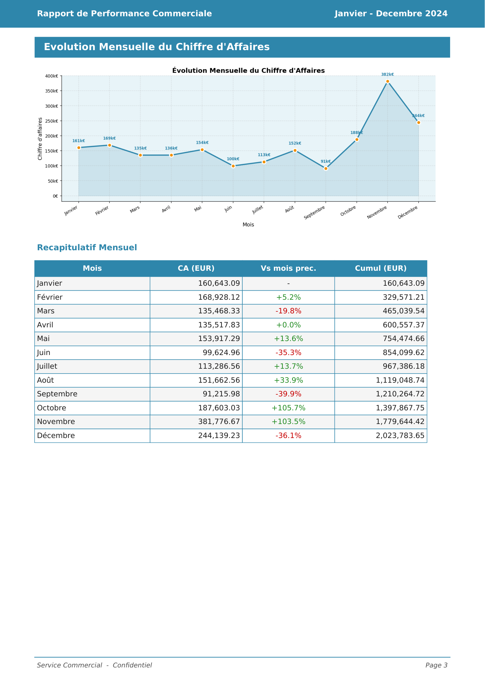 | **Évolution mensuelle** : courbe du CA, et pour chaque mois le CA, la variation par rapport au mois précédent et le cumul |
| 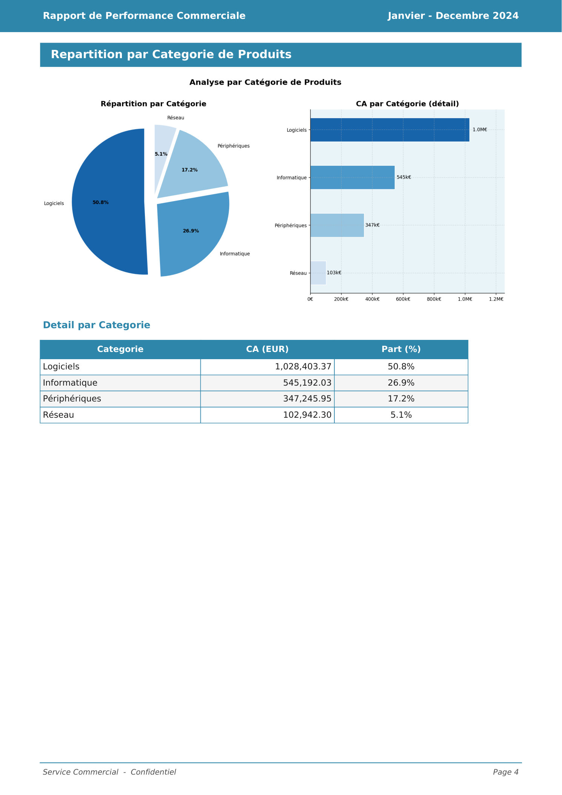 | **Catégories** : part de chaque catégorie en camembert et en barres, tableau du CA et du pourcentage |
| 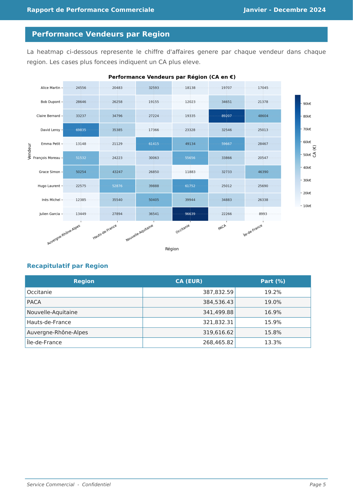 | **Vendeurs × régions** : heatmap du CA par vendeur et par région, tableau du CA et de la part de chaque région |
| 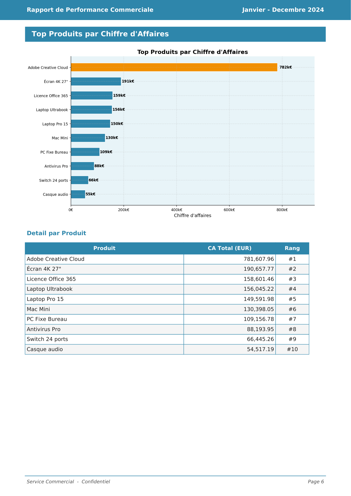 | **Top produits** : classement des produits par CA, tableau avec rang et CA exact |

## 10. Analyses et résultats détaillés

### Performance

| Mesure | Valeur |
|---|---|
| Temps du travail manuel remplacé | 5 heures par mois |
| Durée d'exécution du pipeline complet (ligne de commande) | environ 3 secondes |
| Volume traité | 12 fichiers, 1 163 lignes |
| Livrables produits | 5 graphiques PNG et 1 rapport PDF de 6 pages |
| Interventions humaines nécessaires | aucune en mode planifié |
| Génération depuis l'application web | moins de 2 secondes, progression affichée étape par étape |
| Poids de la page d'accueil | environ 190 Ko transférés, 18 requêtes, aucun décalage de mise en page |

### Robustesse face aux données mal saisies

Pour vérifier la fiabilité du nettoyage, l'application dégrade volontairement les 12 fichiers de démonstration. Voici ce que le pipeline détecte et corrige :

| Anomalie dans les fichiers bruts | Lignes concernées | Correction appliquée |
|---|---|---|
| Doublons exacts | 17 | Supprimés |
| Dates manquantes ou illisibles | 12 | Lignes supprimées |
| Champs texte vides | 13 | Remplacés par `Inconnu` |
| Montants manquants | 12 | Remplacés par la médiane |
| Remises saisies en % (`10` au lieu de `0.10`) | 217 | Divisées par 100 |
| Quantités ou prix négatifs | 12 | Ramenés à 0 |
| Statuts mal orthographiés | 231 | Harmonisés |

Comparaison des indicateurs calculés sur les données propres et sur les mêmes données dégradées :

| Indicateur | Données propres | Données dégradées puis nettoyées | Écart |
|---|---|---|---|
| Lignes exploitables | 1 163 | 1 151 (sur 1 180 brutes) | -1,0 % |
| CA comptabilisé | 2 023 784 € | 2 001 050 € | -1,1 % |
| Commandes actives | 731 | 723 | -1,1 % |
| Panier moyen | 2 769 € | 2 768 € | 0,0 % |
| Taux d'annulation | 37,2 % | 37,2 % | 0,0 % |

Sans la correction des remises, les 217 remises saisies en pourcentage suffisent à rendre le chiffre d'affaires négatif (−1 479 229 €). Après nettoyage, l'écart restant de 1,1 % vient surtout des 12 lignes sans date, qui ne peuvent être rattachées à aucun mois et sont écartées, et à la marge des montants manquants estimés par la médiane.

### Exemple de résultats produits (données de démonstration 2024)

| CA comptabilisé | Commandes actives | Panier moyen | Remises accordées | Taux d'annulation | Vendeurs | Produits |
|---|---|---|---|---|---|---|
| 2 023 784 € | 731 | 2 769 € | 171 612 € | 37,2 % | 10 | 15 |

- **Saisonnalité** : novembre est le meilleur mois (381 777 €), plus du double d'un mois moyen, et septembre le plus faible (91 216 €).
- **Catégories** : les Logiciels représentent 51 % du CA (1 028 403 €), devant l'Informatique (27 %).
- **Vendeurs** : Claire Bernard arrive en tête avec 252 402 €, devant Emma Petit (232 961 €) et Hugo Laurent (227 794 €).

Ces chiffres proviennent de données fictives : ils illustrent ce que le rapport met en évidence, pas la situation d'une entreprise réelle.

## 11. Utilisation au quotidien

### Rapport mensuel

Chaque mois, copier les exports CSV dans `data/raw/` puis lancer :

```bash
python main.py --periode "Novembre 2024"
```

Le texte de `--periode` est libre (`"T3 2024"`, `"Bilan annuel 2024"`…) et s'affiche sur la page de garde. Le rapport est déposé dans `output/rapports/` avec un nom horodaté, par exemple `rapport_20241201_083012.pdf`.

### Génération automatique

```bash
python main.py --mode schedule
```

Le processus génère un rapport immédiatement, puis un nouveau le 1er de chaque mois à 8 h. Pour une exécution durable sur un serveur, le lancer via un service système (Planificateur de tâches Windows, systemd).

### Toutes les options

```
python main.py [--periode "..."] [--mode once|schedule]

  --periode   Libellé de la période affiché dans le rapport (par défaut : mois courant)
  --mode      once      génère un rapport et s'arrête (par défaut)
              schedule  génère un rapport le 1er de chaque mois à 8 h
```

### Personnalisation

Les réglages métier et visuels sont centralisés dans [`config.py`](config.py), sans toucher au pipeline :

```python
RAPPORT_TITRE              = "Rapport de Performance Commerciale"  # titre du PDF
RAPPORT_AUTEUR             = "Service Commercial"                  # pied de page
RAPPORT_COULEUR_PRINCIPALE = "#2E86AB"                             # couleur principale
TOP_VENDEURS_N             = 10                                    # taille des classements
EXCLUDED_STATUTS           = ["Annulé", "Retourné"]                # statuts exclus du CA
```

## 12. Principaux enseignements

**Sur la démarche**
- **Partir du temps perdu par l'utilisateur** donne un objectif mesurable : chaque étape automatisée correspond à une tâche manuelle identifiée.
- **Un livrable doit être utilisable sans moi** : un rapport lisible par une direction, une démo accessible à un recruteur, une documentation qui permet de reprendre le projet.

**Sur les données**
- **Les erreurs les plus graves sont silencieuses** : une remise saisie `10` au lieu de `0.10` ne provoque aucune erreur, mais rend le CA négatif. Seul un contrôle explicite la détecte.
- **Toute valeur manquante n'a pas la même gravité** : un prix manquant peut être estimé, une date manquante rend la ligne inutilisable.
- **Ne pas dépendre de la langue du système** : les noms de mois sont tirés d'un dictionnaire français, sinon le rapport afficherait « January » sur un serveur configuré en anglais.

**Sur le code**
- **Séparer le cœur des interfaces** paie : l'application web, puis sa refonte complète, ont été ajoutées sans réécrire le pipeline, avec un seul paramètre supplémentaire (le dossier de sortie).
- **Les tests protègent aussi des mises à jour** : ils ont signalé le changement de comportement de pandas 3 sur les colonnes de texte.
- **Une application web sert plusieurs visiteurs à la fois** : matplotlib n'étant pas prévu pour cela, les exécutions sont sérialisées et chacune écrit dans son propre dossier temporaire.
- **Un PDF doit embarquer ses polices** pour afficher correctement les accents et le symbole € sur toutes les machines.
- **Un fichier minuscule peut coûter très cher** : 12 Ko de CSV avec 300 vendeurs et 300 régions bloquaient le serveur 73 secondes. Des limites vérifiées avant le calcul ramènent ce cas à 0,1 seconde.

**Sur l'interface**
- **Une animation doit expliquer quelque chose** : la progression réelle du pipeline, l'apparition d'un graphique ou le passage d'une vue à l'autre. Les animations décoratives ont été écartées, et toutes disparaissent si l'utilisateur préfère réduire les animations.
- **Un design system évite les valeurs au hasard** : une couleur, une durée ou un espacement se modifient à un seul endroit.
- **Le responsive se vérifie sur de vrais écrans** : une simple grille sans `minmax(0, 1fr)` laissait un tableau élargir toute la page sur mobile, sans que rien ne déborde visiblement.
- **Une progression honnête rassure** : afficher l'étape réellement en cours vaut mieux qu'une barre de chargement simulée.

## 13. Structure du projet

```
sales-report-automation/
├── README.md
├── LICENSE
├── main.py                      Point d'entrée en ligne de commande
├── app.py                       Point d'entrée web : st.App sert l'interface et l'API
├── config.py                    Chemins, règles métier, titre et couleurs du rapport
├── generate_data.py             Génération des données de démonstration
├── demo_colab.ipynb             Démonstration pas à pas dans Google Colab
├── requirements.txt             Dépendances Python
├── pyproject.toml               Métadonnées du projet et configuration des outils
├── Dockerfile                   Image de l'application web
├── DejaVuSans*.ttf              Polices Unicode embarquées dans le PDF
├── webapp/
│   ├── api.py                   Routes web : page, fichiers statiques, API de génération en flux
│   ├── service.py               Préparation des données, contrôles, exécution du pipeline, cache
│   ├── fallback.py              Page « introuvable » (Streamlit) pour les adresses inconnues
│   └── static/
│       ├── index.html           Page unique : accueil et vue rapport
│       └── assets/
│           ├── css/             tokens, base, composants, sections, tableau de bord
│           ├── js/              motion, composants, démo, tableau de bord, graphiques
│           ├── fonts/           Police Inter variable (allégée)
│           └── img/             Aperçus WebP du rapport
├── src/
│   ├── extractor.py             1. Lecture et fusion des CSV
│   ├── cleaner.py               2. Nettoyage et standardisation
│   ├── transformer.py           3. Calcul des KPIs et agrégations
│   ├── visualizer.py            4. Les 5 graphiques
│   ├── reporter.py              5. Le rapport PDF
│   └── scheduler.py             Exécution automatique mensuelle
├── tests/                       Tests automatisés (pytest)
├── examples/                    Exemple de CSV source et de rapport PDF
├── docs/images/                 Captures du rapport et de l'application
├── .streamlit/                  Réglages du serveur Streamlit
├── .devcontainer/               Environnement GitHub Codespaces
├── .github/dependabot.yml       Mise à jour automatique des dépendances
├── data/raw/                    Fichiers CSV d'entrée (non versionnés)
└── output/                      Rapports, graphiques et journaux générés (non versionnés)
```

## 14. Reproduire le projet

**Option 1 : tester en ligne (recommandé, aucune installation)**

1. Ouvrir la [démo en ligne](https://sales-report-automation.streamlit.app). Si personne ne l'a utilisée récemment, elle peut mettre une trentaine de secondes à démarrer.
2. Cliquer sur **Générer un rapport de démo**, ou déposer ses propres fichiers CSV dans la section **Démo**.
3. Télécharger le rapport PDF.

**Option 2 : installer le projet sur son poste**

Prérequis : [Python 3.11 ou plus récent](https://www.python.org/downloads/).

```bash
git clone https://github.com/GomuGomuNo01/sales-report-automation.git
cd sales-report-automation
python -m venv .venv
source .venv/bin/activate            # Windows : .venv\Scripts\activate
pip install -r requirements.txt

python generate_data.py              # 12 mois de données de démonstration
python main.py --periode "Janvier - Décembre 2024"
# Le rapport se trouve dans output/rapports/

streamlit run app.py                 # Application web sur http://localhost:8501
# ou : uvicorn app:app               # n'importe quel serveur ASGI, sur http://localhost:8000
```

**Option 3 : sans installer Python**

- **Docker** : `docker build -t sales-report .` puis `docker run -p 8501:8501 sales-report`, et ouvrir http://localhost:8501.
- **GitHub Codespaces** (compte GitHub) : [](https://codespaces.new/GomuGomuNo01/sales-report-automation?quickstart=1) ouvre le projet dans un VS Code en ligne, avec l'application lancée automatiquement.
- **Google Colab** (compte Google) : [](https://colab.research.google.com/github/GomuGomuNo01/sales-report-automation/blob/main/demo_colab.ipynb) exécute le pipeline cellule par cellule (menu *Exécution > Tout exécuter*).

**Lancer les tests :**

```bash
pytest
pytest --cov=src --cov-report=term-missing   # avec la couverture (pip install pytest-cov)
```

**Mettre l'application en ligne** (Streamlit Community Cloud, gratuit)

1. Se connecter sur [share.streamlit.io](https://share.streamlit.io) avec son compte GitHub.
2. **Create app**, puis choisir ce dépôt, la branche `main` et le fichier `app.py`.
3. Dans **App URL**, saisir `sales-report-automation` (adresse utilisée dans ce README).
4. Dans **Advanced settings**, choisir **Python 3.12**.
5. Cliquer sur **Deploy**. Chaque push sur `main` met ensuite l'application à jour.

L'image Docker peut aussi être déployée sur Hugging Face Spaces, Render ou Railway (le port se règle avec la variable `PORT`).

**Problèmes courants**

| Problème | Cause | Solution |
|---|---|---|
| `Aucun fichier CSV trouvé dans data/raw/` | Le dossier d'entrée est vide | Copier les CSV dans `data/raw/`, ou lancer `python generate_data.py` |
| `Colonnes manquantes dans les données` | Un fichier n'a pas les 9 colonnes attendues | Vérifier les noms de colonnes (sensibles à la casse) et le séparateur virgule |
| Accents illisibles dans Excel (`é`) | Excel lit le fichier dans un autre encodage | *Données > À partir d'un fichier texte/CSV*, encodage UTF-8 |
| Rapport PDF vide ou tronqué | Polices introuvables | Vérifier la présence des fichiers `DejaVuSans*.ttf` à la racine |
| Le rapport planifié ne se génère pas | Le processus a été arrêté | Relancer `python main.py --mode schedule` via un service système |

## 15. Limites et pistes d'amélioration

**Limites**
- **Données fictives** : les ventes sont tirées au hasard de façon uniforme. Les constats chiffrés (par exemple un taux d'annulation de 37 %) illustrent le fonctionnement de l'outil, pas une situation réelle.
- **Statuts inconnus** : une ligne dont le statut n'est pas reconnu est classée `Inconnu` et reste comptée dans le CA, car seuls les statuts annulé et retourné sont exclus.
- **Période par défaut** : sans `--periode`, le libellé du mois courant dépend de la langue du système.
- **Format d'entrée strict** : CSV séparé par des virgules, noms de colonnes exacts. Les fichiers Excel ou séparés par des points-virgules ne sont pas acceptés.
- **Planificateur simple** : il fonctionne tant que le processus reste lancé ; il ne remplace pas un ordonnanceur système.
- **Hébergement gratuit** : la démo en ligne se met en veille quand elle n'est pas utilisée.
- **Une génération à la fois** : les demandes simultanées attendent leur tour. Les envois sont limités à 30 fichiers, 20 Mo, 200 vendeurs, 50 régions et 50 catégories.
- **Rapports en mémoire** : un rapport généré en ligne reste téléchargeable une heure, puis il est effacé.

**Pistes d'amélioration**
- Accepter les fichiers **Excel** et détecter automatiquement le **séparateur** et l'**encodage**.
- Ajouter une **comparaison avec la période précédente** (N-1, mois précédent) sur la page de garde.
- **Envoyer automatiquement le rapport par e-mail** après chaque génération planifiée.
- Lire les ventes directement depuis une **base de données** ou l'API de l'ERP plutôt que depuis des CSV.
- Exécuter les tests à chaque push avec **GitHub Actions**.
- Exporter les agrégats dans un **classeur Excel** en complément du PDF.

## 16. Crédits

- Polices : [DejaVu Fonts](https://dejavu-fonts.github.io/) pour le PDF (licence libre), [Inter](https://rsms.me/inter/) pour l'interface (SIL Open Font License).
- Bibliothèques : pandas, matplotlib, seaborn, fpdf2, Streamlit, Starlette, pytest.
- Licence du projet : [MIT](LICENSE).

**Auteur :** Dibie Elisee Jules Cedric KOUADIO ([@GomuGomuNo01](https://github.com/GomuGomuNo01))
