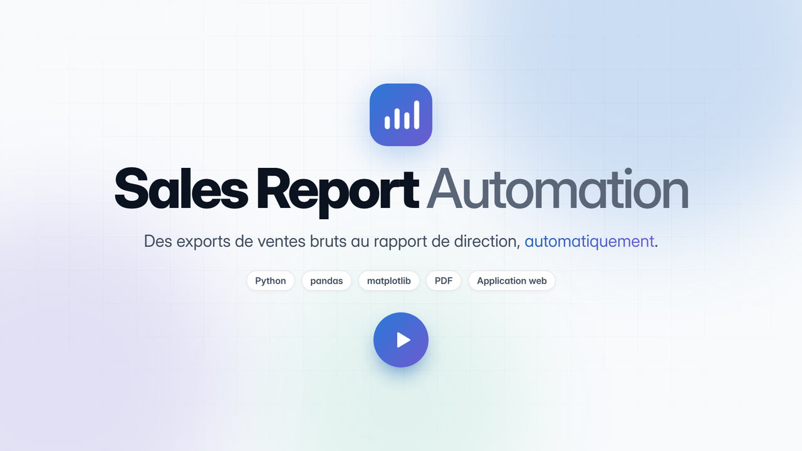

# Vidéo de présentation

Une vidéo de 40 secondes en motion design qui présente l'application : le problème qu'elle résout, son fonctionnement en 5 étapes, le résultat obtenu et ses avantages.

[](https://gomugomuno01.github.io/sales-report-automation/presentation/)

Elle se regarde dans la page « Présentation » publiée sur GitHub Pages : [gomugomuno01.github.io/sales-report-automation/presentation/](https://gomugomuno01.github.io/sales-report-automation/presentation/).

| Fichier | Contenu |
|---|---|
| [`SalesReport_presentation.mp4`](SalesReport_presentation.mp4) | La vidéo : 1920 × 1080, 30 images par seconde, H.264 + AAC, 40 s |
| [`presentation-poster.jpg`](presentation-poster.jpg) | Image d'aperçu (README et lecteur) |
| [`index.html`](index.html) | La page « Présentation » : un lecteur vidéo, publiée sur GitHub Pages par [`deploy-pages.yml`](../../.github/workflows/deploy-pages.yml) |
| [`musique.mp3`](musique.mp3) | La bande-son seule |
| [`source/`](source/) | Tout ce qu'il faut pour la régénérer |

## Déroulé

| Temps | Scène |
|---|---|
| 0 à 4 s | Le nom du projet et sa promesse |
| 4 à 10 s | Le problème : 12 exports mensuels, des erreurs de saisie, 5 heures de travail manuel |
| 10 à 22 s | Le fonctionnement : extraction, nettoyage, calcul, graphiques, rapport PDF, le tout en environ 3 secondes |
| 22 à 30 s | Le résultat : tableau de bord et rapport PDF de 6 pages |
| 30 à 36 s | Les avantages : temps gagné, chiffres fiabilisés, rapport automatique, calculs testés |
| 36 à 40 s | L'adresse de la démo en ligne |

Les chiffres affichés sont ceux de l'application, sur les données de démonstration.

## Musique : libre de droits

La musique a été **composée et synthétisée spécialement pour cette vidéo** par le script [`source/musique.py`](source/musique.py) : chaque son (nappe, basse, arpège, batterie, effets) est fabriqué à partir de sinusoïdes et de bruit. Aucun échantillon, aucune boucle et aucun morceau existant n'est utilisé. Elle est diffusée sous la même licence que le projet ([MIT](../../LICENSE)) : elle peut être réutilisée librement.

Sa structure suit les scènes de la vidéo (120 BPM, une mesure toutes les 2 secondes) : montée avant chaque changement de scène, signal à chaque badge d'erreur, note de carillon à chaque étape du pipeline et à chaque carte d'avantage, impact sur le résultat et sur la conclusion.

## Régénérer la vidéo

L'animation est une page HTML ([`source/presentation.html`](source/presentation.html)) aux couleurs du thème clair de l'application. Ouverte dans un navigateur, elle tourne en boucle (un clic lance la musique). [`source/rendu.py`](source/rendu.py) la capture image par image avec Chromium, puis assemble l'image et le son avec ffmpeg.

```bash
pip install -r requirements.txt playwright imageio-ffmpeg
playwright install chromium

python assets/video/source/rendu.py                        # vidéo, musique et aperçu (quelques minutes)
python assets/video/source/rendu.py --images 4 12 25 37.5  # quelques images fixes, pour vérifier la mise en page
python assets/video/source/musique.py musique.wav          # la musique seule
```

La police Inter (licence SIL Open Font License) et les pages du rapport PDF viennent de l'application (`webapp/static/assets/`).
